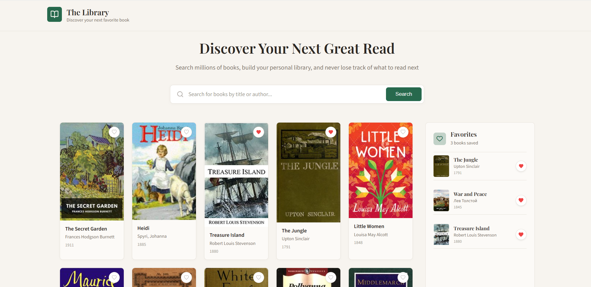

# Book Catalog

## Description

Book Catalog is a small frontend application
for browsing, searching, and filtering books.

## Features

- browse books;
- search books;
- add books to favorites;
- save data to Local Storage.

## Technologies

- HTML
- CSS
- JavaScript
- Vite
- npm

## Installation and Usage

Clone the repository:

```bash
git clone <repository-url>
```

Navigate to the project directory:

```bash
cd book-catalog
```

Install dependencies:

```bash
npm install
```

Start the development server:

```bash
npm run dev
```

## Production Build

To create a production build, run:

```bash
npm run build
```

The production files will be generated in the `dist/` directory.

## Screenshots



## Future Improvements

- add sorting;
- add pagination;
- add a separate book details page.